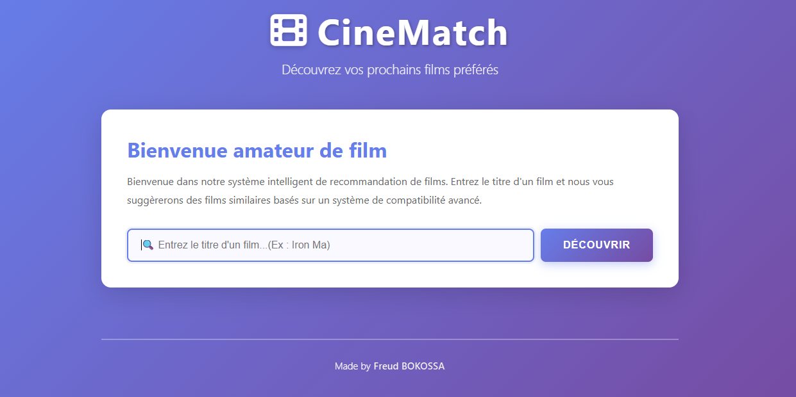

# 🎬 CineMatch - Système de Recommandation de Films

Un système intelligent de recommandation de films basé sur un algorithme de compatibilité avancé. CineMatch analyse les films et suggère des contenus similaires à ceux que vous recherchez.

## ✨ Caractéristiques Principales

- **🔍 Recherche intelligente** : Entrez le titre d'un film pour trouver des recommandations similaires
- **📊 Score de compatibilité** : Visualisez le pourcentage de compatibilité pour chaque film recommandé via un algorithme de Machine Learning
- **💾 Base de données IMDB** : Utilise les données de films IMDB pour des recommandations précises
- **🎨 Interface moderne** : Design attrayant et responsive avec animations fluides
- **⚡ Performance optimisée** : Recherches rapides et résultats instantanés
- **📱 Responsive design** : Adapté pour tous les appareils (desktop, tablette, mobile)

## 🛠️ Stack Technologique

### Backend
- **Python 3.10** - Langage de programmation principal
- **Django** - Framework web
- **CSV** - Format de fichier de la base de donnée csv avec plus d'un millon de titre

### Frontend
- **HTML5** - Structure sémantique
- **CSS3** - Design moderne avec gradients et animations
- **JavaScript (Vanilla)** - Interactivité et gestion des événements
- **Font Awesome 6** - Icônes professionnelles

## 📁 Structure du Projet

```
Movie-Recommandation/
├── README.md                           # Documentation principale
├── requirements.txt                    # Dépendances Python
├── Recommandation/                     # Application Django principale
│   ├── manage.py                       # Gestionnaire Django
│   ├── db.sqlite3                      # Base de données
│   ├── Recommendation/                 # Configuration Django
│   │   ├── settings.py
│   │   ├── urls.py
│   │   └── wsgi.py
│   └── Core/                           # Application Django
│       ├── models.py                   # Modèles de données
│       ├── views.py                    # Vues backend
│       ├── urls.py                     # Routes URL
│       ├── load_data.py                # Chargement des données
│       ├── templates/Core/
│       │   ├── index.html              # Page principale
│       │   └── affichage.html          # Page d'affichage
│       └── static/Core/
│           ├── css/
│           │   └── style.css           # Styles (design moderne)
│           └── js/
│               └── script.js           # Logique frontend
└── Recommandation imdb/                # Notebook Jupyter
    └── movie recommendation.ipynb      # Analyse  modèle et test 
```

## 🚀 Installation et Configuration

### Prérequis
- Python 3.7+
- pip (gestionnaire de paquets Python)
- Git

### Étapes d'installation

1. **Cloner le repository**
```bash
git clone https://github.com/FreudArthur/Movie-Recommandation.git
cd Movie-Recommandation/Recommendation
```

2. **Installer les dépendances**
```bash
pip install -r requirements.txt
```


3. **Lancer le serveur de développement**
```bash
python manage.py runserver
```

4. **Accéder à l'application**
- Ouvrez votre navigateur et allez à : `http://localhost:8000/` et laisser la magie opérer


## 📖 Utilisation

1. **Accédez à la page principale** : Vous verrez une interface intuitive avec un champ de recherche
2. **Entrez le titre d'un film** : Tapez le nom du film que vous aimez
3. **Cliquez sur "Découvrir"**
4. **Consultez les recommandations** : Découvrez les films similaires avec leur score de compatibilité

PS : Il se peut que les films proposés ne cadrent pas forcément avec ceux qui ont été demandé (notamment ceux qui donnent 100% de compatibilité) et qu'on ne trouve pas votre film même s'il est bien écrit (🥹🤧 Je suis désolé et je m'en excuse d'avance)

## 🧠 Algorithme de Recommandation

Le système utilise un algoritthme de compatibilité basé sur :
- **Similarité de contenu** : Genres, thèmes, réalisateurs
- **Analyse des métadonnées** : Descriptions, notes, années
- **Score de compatibilité** : Pourcentage affichant la probabilité que vous aimiez le film recommandé

## 🎨 Interface Utilisateur

### Thème Design
- **Gradient prismatique** : Violet et bleu pour une ambiance cinématique
- **Cartes élégantes** : Ombres douces et animations fluides
- **Icône professionnelle** : Logo de cinéma animé (Font Awesome)
- **Footer discret** : Signature de l'auteur
- **Animations** : Transitions smooth et entrées élégantes

### Composants
- Barre de recherche avec placeholder descriptif
- Spinner de chargement pendant la recherche
- Grille responsive des résultats
- Messages d'erreur clairs et visibles
- Footer avec attribution

## 📊 Données

- **Source** : Dataset IMDB avec plus d'un million de films disponilble et téléchargeable sur le depot


## 📝 Notes de Développement

- **Backend** : Logique pure Django avec ORM models
- **Frontend** : JavaScript vanilla pour une performance optimale
- **API** : Communication via fetch POST/JSON
- **CORS** : Configuré pour requêtes locales

## 🐛 Dépannage

### Le serveur ne démarre pas
```bash

python manage.py runserver 8000
```

### Les films ne s'affichent pas

- Vérifiez que les données existent : `Recommandation imdb\dataset movies imdb\TMDB_movie_dataset_v11.zip`

### Les styles CSS ne s'appliquent pas
```bash
python manage.py collectstatic
# Et redémarrez le serveur
```

## 👨‍💻 Auteur

**Freud BOKOSSA**

## 📄 Licence

Ce projet est fourni à titre éducatif et pour entrainer mes compétences de Machine Learning et de Web Developpement. N'hésitez pas pour vos retours.

## 🤝 Contribution

Les contributions sont bienvenues ! N'hésitez pas à :
1. Fork le projet
2. Créer une branche feature (`git checkout -b feature/AmazingFeature`)
3. Commit vos changements (`git commit -m 'Add some AmazingFeature'`)
4. Push vers la branche (`git push origin feature/AmazingFeature`)
5. Ouvrir une Pull Request

## 📞 Support

Pour toute question ou problème, veuillez ouvrir une issue dans le repository.

---

**Dernière mise à jour** : Février 2026
**Version** : 1.0.0

</img>
